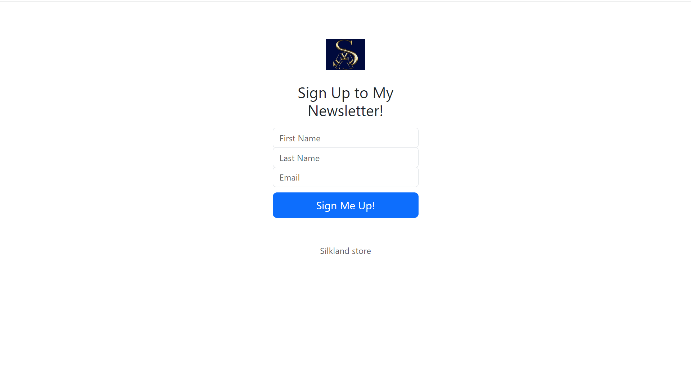

<h1><em>MailchimpAPI - SignUp<em></h1>

  <h3>Technologies Used</h3>
   <ul>
      <li><a href="https://www.w3schools.com/html/" target="_blank">HTML</a></li>
      <li><a href="https://www.w3schools.com/css/" target="_blank">CSS</a></li>
      <li><a href="https://www.w3schools.com/js/" target="_blank">JavaScript</a></li>
      <li><a href="https://getbootstrap.com/" target="_blank">Bootstrap</a></li>
      <li><a href="https://nodejs.org/en/" target="_blank">Node.js</a></li>
      <li><a href="https://expressjs.com/" target="_blank">Express.js</a></li>
      <li><a href="https://mailchimp.com/developer/marketing/docs/fundamentals/" target="_blank">Mailchimp Developer API</a></li>
      <li><a href="https://www.npmjs.com/package/nodemon" target="_blank">npm i nodemon</a></li>
      <li><a href="https://www.npmjs.com/package/body-parser" target="_blank">npm i body-parser</a></li>
   </ul>